# finman — Architecture

**Version:** 1.1
**Status:** `Draft`
**Erstellt:** 2026-08-26
**Zuletzt aktualisiert:** 2026-08-26

---

## Changelog

| Version | Datum      | Änderung |
| ------- | ---------- | -------- |
| 1.1     | 2026-08-26 | An überarbeiteten Code angeglichen: FormView-/ListView-Umbau, `TransactionInfo`, Regel-CRUD + „Regeln anwenden" (neuer Ablauf §4.7), Meta-Schnellbearbeitung, 17 Routen |
| 1.0     | 2026-08-26 | Initiale Version |

---

## KI-Kontext

```
Zweck           : Wie die finman-App konkret funktioniert —
                  CSV-Import, automatische Kategorisierung, Prognosen,
                  EÜR-Bericht. Kein Ersatz für Code-Kommentare oder
                  vollständige Doku.
Fachliches Was  : doc/euer_manager_spec.md (Ist-Stand, v2.0)
Feature-Details : —
Verwandter Code : src/finman/
```

> **Hinweis zum Umfang:** Dieses Dokument beschreibt den Ist-Zustand aus dem Code.
> Es zeigt nur, was andere Docs nicht zeigen können — konkrete Abläufe und
> Strukturen als Diagramme. Kein Code im Dokument.

---

## 1. Systemübersicht

> Lokal laufende Django-Webapp zur Verwaltung der Einnahmen-Überschuss-Rechnung.
> Ein Nutzer bedient die App im Browser; Bank-CSV-Exporte werden importiert;
> alle Daten liegen in einer lokalen SQLite-Datei.

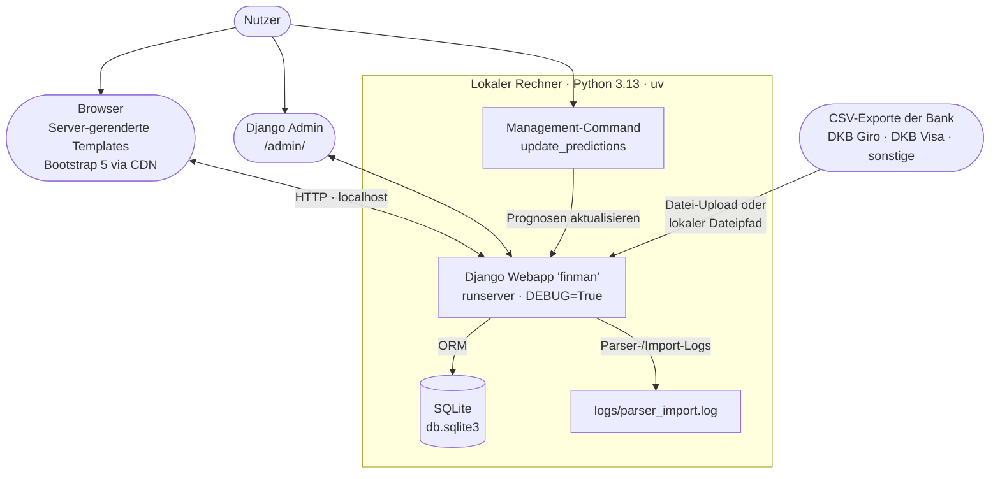

---

## 2. Bausteine & Schichten

> Eine einzige Django-App `transactions` trägt alle Fachlichkeit.
> Schichtung: URLs → Views → Services → Models. Das Parser-Paket kapselt
> die bankenspezifischen CSV-Formate.

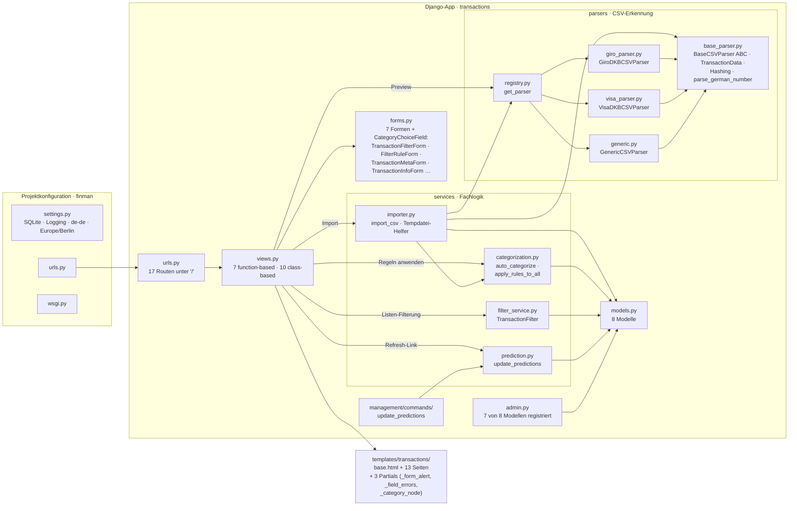

> **Konvention:** Views enthalten nur HTTP-Aufbereitung (Forms, Pagination,
> Aggregationen fürs Template). Wiederverwendbare Fachlogik liegt in `services/`,
> Formatwissen in `parsers/`. Ausnahmen: die Detail-Ansicht und die drei
> Quick-Edit-Endpunkte der Liste schreiben manuelle Kategorien bzw.
> `TransactionMeta` direkt über das ORM (siehe §4.4).

---

## 3. Datenmodell

> Sieben Kernmodelle plus `TransactionInfo`. Zentral ist `Transaction`
> (dedupliziert über SHA-256-Hash). Kategorien hängen n:m über
> `TransactionCategory`; `TransactionMeta` speichert als Snapshot, welche Regel
> welche Attribute (Art/Priorität/Intervall) gesetzt hat; `TransactionInfo`
> hält eine freie Notiz je Transaktion.

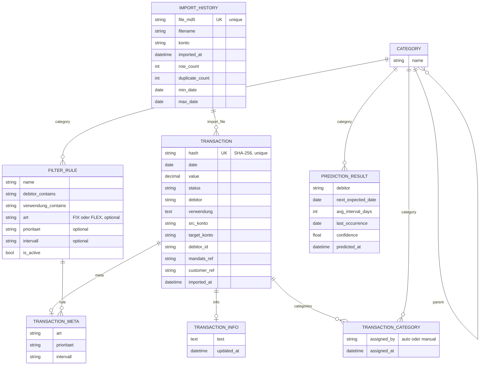

> **Wesentliche Regeln:**
>
> - `Category` ist hierarchisch (`parent` auf sich selbst); `get_descendants()`
>   liefert die gesamte Teilbaum-ID-Liste — genutzt beim Filtern und bei der
>   Lösch-Sperre.
> - `Transaction.hash` (SHA-256 über Datum, Debitor, Betrag, Verwendung,
>   Ziel-/Quellkonto) verhindert Zeilen-Duplikate; `ImportHistory.file_md5`
>   verhindert Datei-Duplikate (siehe §5.2).
> - `TransactionMeta` ist ein 1:1-Snapshot pro Transaktion und verweist optional
>   auf die auslösende `FilterRule`.
> - `PredictionResult` ist ein berechneter Datensatz, der über `(debitor,
>   category)` eindeutig bestimmt wird — nicht über eine FK zu `Transaction`.
> - `TransactionInfo` ist eine freie Nutzer-Notiz (1:1), losgelöst von
>   Kategorien/Regeln; gepflegt über die Detailseite.
> - Löschen von `Category`, `FilterRule`, `Transaction` setzt Referenzen auf
>   `NULL` bzw. kaskadiert nur bei den Assoziationstabellen.

---

## 4. Schlüssel-Abläufe

### 4.1 CSV-Import End-to-End

> Der wichtigste Ablauf: Von Upload/Pfad bis zur kategorisierten Transaktion.
> Zeigt das Zusammenspiel ImportView → Parser-Preview → Importer → Auto-Kategorisierung.

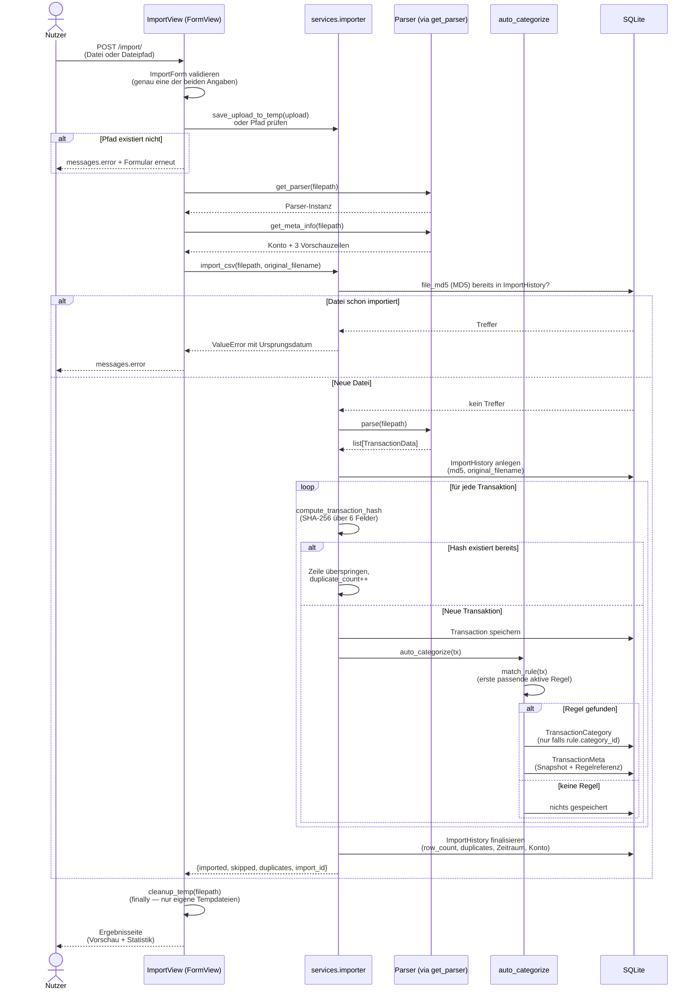

### 4.2 Parser-Auswahl zur Laufzeit

> Die Detect-Kette: Die Registry probiert die Parser in Listenreihenfolge;
> der erste Treffer gewinnt, der Generic-Parser fängt alles übrige ab.

```mermaid
sequenceDiagram
    participant Caller as Aufrufer<br/>(View oder Importer)
    participant Reg as registry.get_parser
    participant Giro as GiroDKBCSVParser
    participant Visa as VisaDKBCSVParser
    participant Gen as GenericCSVParser

    Caller->>Reg: get_parser(filepath)
    Reg->>Giro: detect(filepath)
    Note over Giro: liest Zeile 1 (utf-8-sig)<br/>Prüft Präfix 'Girokonto;'
    alt Zeile 1 beginnt mit 'Girokonto;'
        Giro-->>Reg: True
        Reg-->>Caller: GiroDKBCSVParser
    else kein Treffer
        Reg->>Visa: detect(filepath)
        Note over Visa: Prüft Präfix 'Karte;'
        alt Zeile 1 beginnt mit 'Karte;'
            Visa-->>Reg: True
            Reg-->>Caller: VisaDKBCSVParser
        else kein Treffer
            Reg->>Gen: detect(filepath)
            Note over Gen: gibt immer True zurück<br/>(Fallback)
            Gen-->>Reg: True
            Reg-->>Caller: GenericCSVParser
        end
    end
```

### 4.3 Automatische Kategorisierung

> Läuft pro neu importierter Transaktion. Erste passende aktive Regel gewinnt;
> die Reihenfolge ergibt sich alphabetisch aus `ordering = ['name']`.

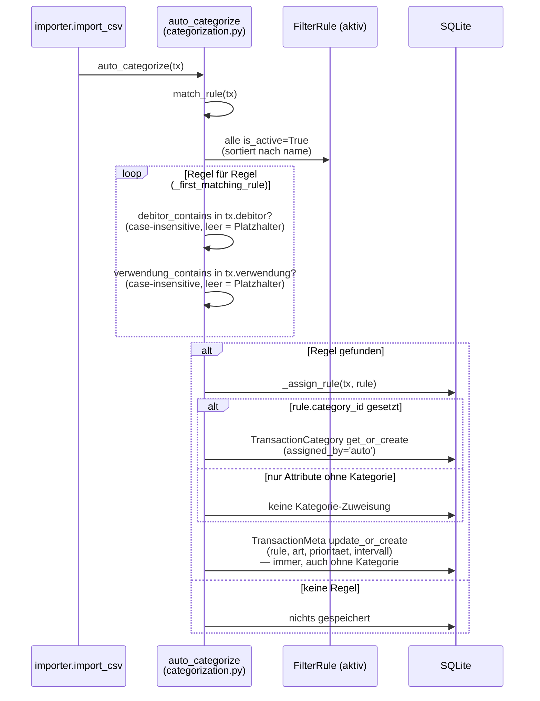

### 4.4 Manuelle Zuweisung und Schnellbearbeitung

> Zwei Wege: Die Detailseite (Kategorie + Meta + Info-Notiz) und die drei
> `require_POST`-Endpunkte für die Schnellbearbeitung aus der Liste heraus.

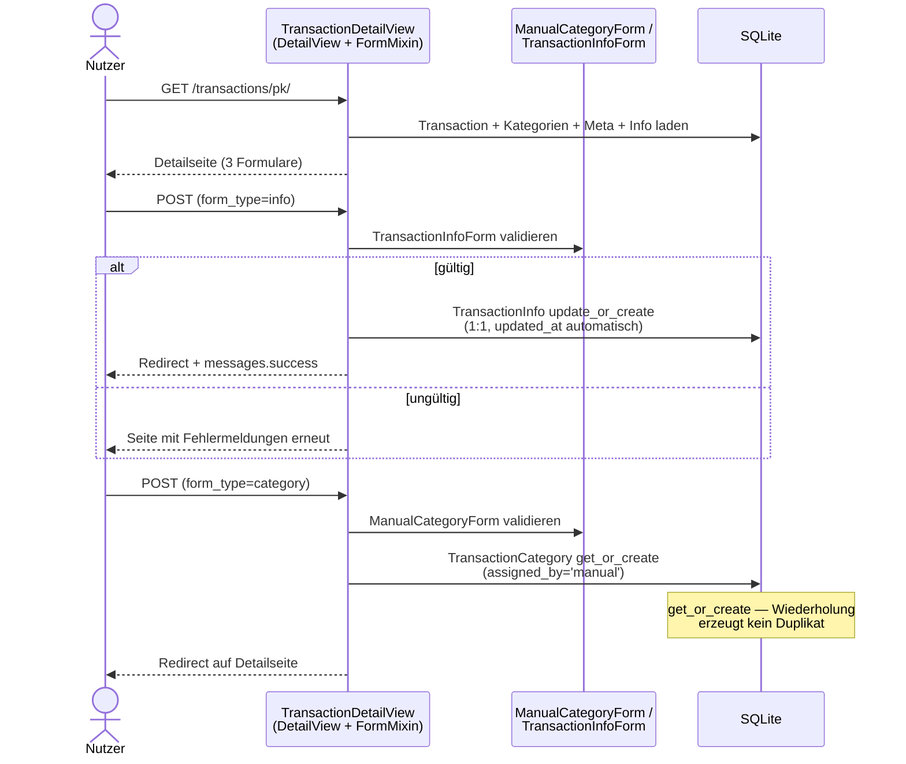

**Quick-Edit-Endpunkte (nur POST, Rücksprung über `next`-Feld):**

| Endpunkt | Wirkung |
|---|---|
| `/transactions/<pk>/meta/` | `TransactionMeta` setzen (art/prioritaet/intervall) + optional Kategorie zuweisen (`assigned_by='manual'`) |
| `/transactions/<pk>/meta/clear/` | Einzelnes Feld (`art` oder `prioritaet`) leeren |
| `/transactions/<pk>/category/<cat_pk>/remove/` | Kategorie-Zuweisung löschen |

> Die Endpunkte schreiben direkt per ORM; das `next`-Feld wird nur bei
> relativen Pfaden akzeptiert (Schutz vor offenen Redirects).

### 4.5 Prognosen aktualisieren

> Zwei Auslöser: Management-Command oder Refresh-Parameter in der Vorhersagen-
> Liste. Gruppiert nach Debitor (gesamt) und Debitor je Kategorie, bildet
> Intervallstatistik und überschreibt `PredictionResult`.

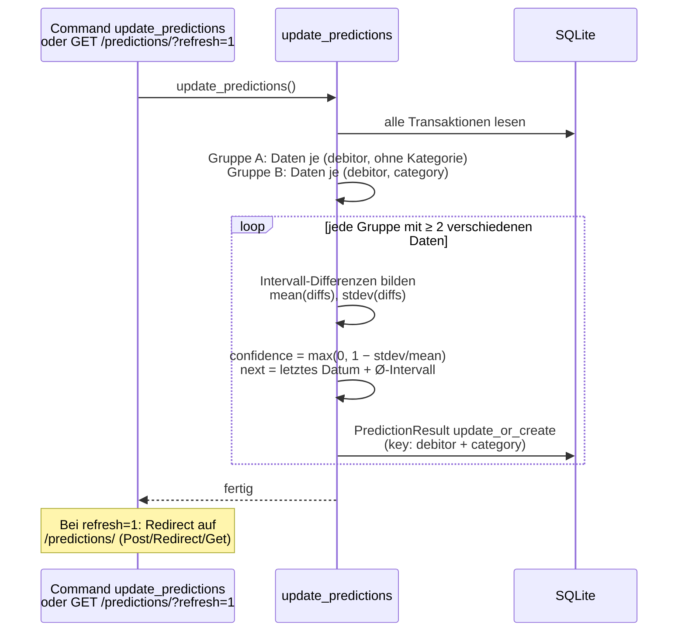

### 4.6 Transaktionsliste filtern

> GET-getriebene Filterkette über den Fluent Builder, validiert durch das
> `TransactionFilterForm`; ListView übernimmt Pagination und Summen-Aggregation.

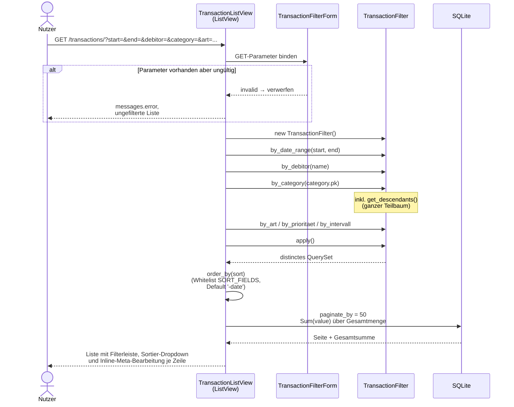

### 4.7 Regeln erneut anwenden

> Button „Regeln anwenden" in der Regelliste (`action=apply_rules`) ruft
> `apply_rules_to_all()` auf: Alle Auto-Zuweisungen und alle Metadaten werden
> gelöscht und aus den aktuell aktiven Regeln neu aufgebaut. Manuelle
> Zuweisungen bleiben unberührt.

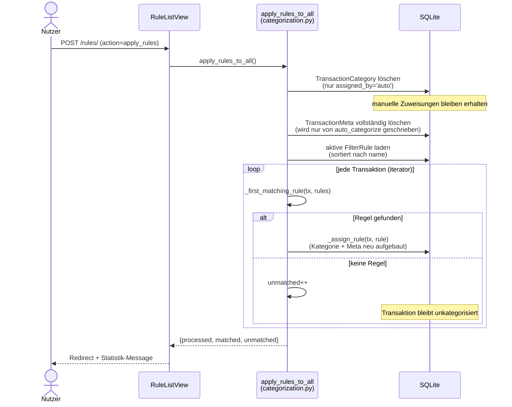

---

## 5. Patterns & Zusammenhänge

### 5.1 Strategy + Registry (CSV-Parser)

> Jede Bankdatei-Form ist eine Strategy hinter der gemeinsamen Schnittstelle
> `BaseCSVParser`; die Registry hält eine geordnete Liste und wählt per
> `detect()` aus. Der Generic-Parser ist bewusst der letzte Eintrag (Fallback).

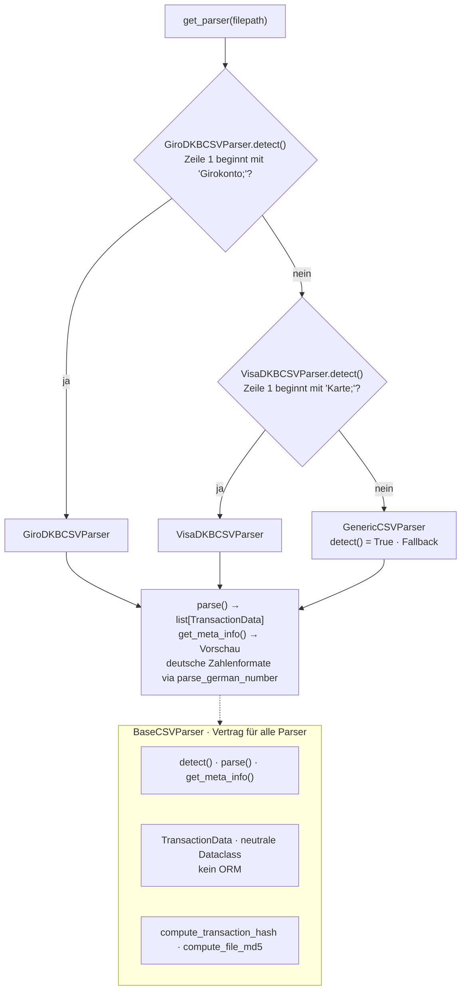

> **Erweiterungspunkt:** Neues Bankformat = neue Unterklasse von
> `BaseCSVParser` + Eintrag in `PARSERS` **vor** `GenericCSVParser`.
> Sonst greift der Fallback zuerst.

### 5.2 Zweistufige Duplikaterkennung

> Ebene 1 bricht den ganzen Import ab (gleiche Datei), Ebene 2 filtert
> einzelne Zeilen heraus (überlappende Zeitraum-Exporte).

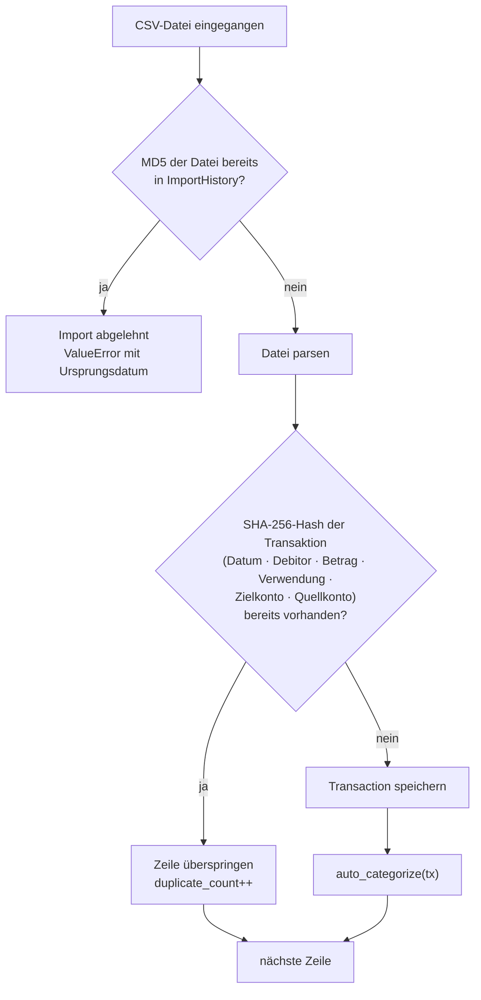

### 5.3 Service-Schichtung

> Wer ruft welche Fachlogik? Views nutzen drei Services direkt, der
> Management-Command teilt sich `update_predictions` mit der Vorhersagen-View.
> Der Importer ist der einzige Orchestrator und ruft seinerseits Services auf.

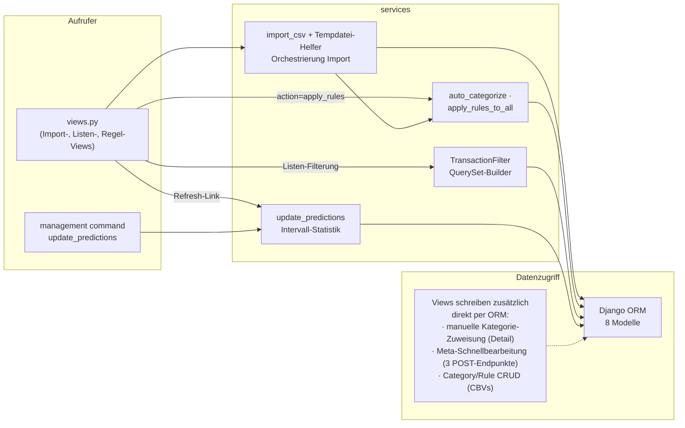

### 5.4 Fluent Filter Builder

> `TransactionFilter` verpackt ein QuerySet in verkettbare Methoden.
> Leere/leere-artige Parameter ändern das QuerySet nicht; jede Methode gibt
> `self` zurück, `apply()` liefert das finale `distinct()`-QuerySet.

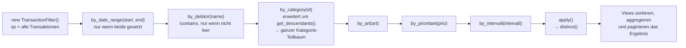

---

## 6. Routing & Navigation

> Alle Fach-Routen hängen unter `/` (include der App-URLs). Die Navbar in
> `base.html` spiegelt die sieben Hauptseiten; Historie, Detail, Quick-Edit-
> Endpunkte sowie Regel-/Kategorie-Unterseiten sind ohne eigenen Nav-Eintrag.

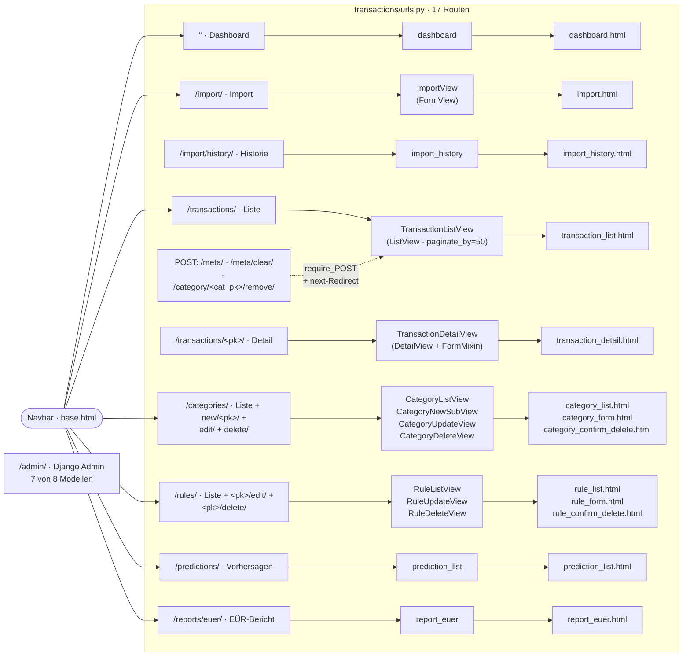

---

## 7. Zustandsdiagramme

Entfallen bewusst. Keine der Entitäten besitzt einen Status-Feld-Lebenszyklus
(`Transaction.status` ist ein Rohdatenfeld aus dem CSV, kein Workflow-Status);
auch der Import ist ein einmaliger Batch-Vorgang ohne persistenten Zustand —
seine Schritte sind in §4.1 und §5.2 vollständig beschrieben.

---

## 8. Offene Technische Fragen

> Technische Entscheidungen, die noch ausstehen.
> Entschiedene Fragen nicht löschen — Status auf `Entschieden: [Begründung]` setzen.

| #    | Frage                                                                                                                                                  | Status  |
| ---- | ------------------------------------------------------------------------------------------------------------------------------------------------------ | ------- |
| T-01 | `SECRET_KEY` und `DEBUG=True` sind hart codiert. Für reinen Lokalbetrieb akzeptabel — fehlt aber ein Profil/Mechanismus, falls die App doch exponiert wird? | `Offen` |
| T-02 | `GenericCSVParser.parse(column_mapping)` bietet Spalten-Mapping an — der Importer nutzt es nie. Fremdformate laufen daher ohne Zuordnung ins Leere.          | `Offen` |
| T-03 | Der Import-View durchläuft die Parser-Kette zweimal (Vorschau + erneut im Importer). Detect-Ergebnis cachen oder Vorschau aus dem Importer liefern?         | `Offen` |
| T-04 | Import läuft ohne `transaction.atomic`: ein Fehler mittendrin hinterlässt Teilimporte plus angelegten `ImportHistory`-Eintrag.                              | `Offen` |
| T-05 | Prognosen aktualisieren sich nicht automatisch nach einem Import — nur per Command oder Refresh-Link. Automatischer Nachlauf gewünscht?                     | `Offen` |
| T-06 | Keine Tests, keine Fixtures im Repo. Mindest-Testabdeckung für Parser, Dedup und Kategorisierung festlegen?                                                | `Offen` |
| T-07 | `TransactionInfo` ist im Django-Admin nicht registriert (alle übrigen Modelle sind es) — Nachtrag gewünscht?                                                | `Offen` |
